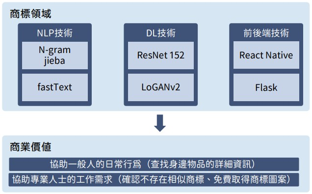

# Logo Shot - Trademark Image Recognition and Generation (Node.js, Python, SQL)  

## 摘要
使用 Node.js 中 React Native 框架架設 Android App。  
使用 Python 處理後端邏輯如影像辨識、文字檢索、商標生成。  
使用 PostgreSQL 儲存並存取商標資料。    
  
建議閱讀 Poster, Slides 或實際下載使用。  
下載連結：https://play.google.com/store/apps/details?id=meow.logoshot  
因原始碼較龐大故不附上，請見諒。  
（此為團隊專案，本人負責部分為文字檢索功能）    

## App 簡介
商標是所有公司行號必備的元素之一，因此快速地搜尋、查找、甚至是產生商標，便是一件重要的事情。  

現有的商標局網站僅能使用文字搜尋，無法以照片進行搜索，也因此增加了商標查找的難度。  

此app利用影像處理、資訊檢索、機器學習等多種技術，不僅強化了文字搜尋結果，也可以進行以圖找圖，還有獨特的商標生成系統，為想申請商標的公司提供方向與靈感。  

## 方法說明
影像辨識：使用 Pre-trained ResNet 152 訓練，再進行 Fine-Tuning  
文字檢索：使用完全比對、近義詞搜索（fastText） 、結果擴充（tf-idf）來達成  
商標生成：使用 VGG 16 提取之圖片特徵，將圖片以 K-means 分群，再以 LoGANv2 模型來訓練  
App：使用 React Native + Python flask 套件來達成  

